# simATAC Tutorial

Welcome to the simATAC simulator! 

simATAC is an R package developed explicitly for simulating single-cell ATAC sequencing (scATAC-seq) count matrices. Given a group of cells having similar biological characteristics in the format of a bin by cell matrix in input, simATAC generates a synthetic bin by cell matrix for the desired number of cells, resembling the real samples. simATAC is an easy to use simulation framework mainly performs estimation and simulation steps to synthesize final counts. simATAC offers the option to convert the simulated bin by cell matrix into the binary version, peak by cell version, and any other feature matrices, with features being any list of genome regions in a BED format. This tutorial gives an overview and introduction to simATAC’s functionality.

Assuming there is a scATAC-seq dataset with cells having similar biological characteristics (e.g. cell type), you can convert BAM files into a bin by cell (5 kbp window) matrix with any customized pipeline. We used Snaptools to generate .snap files which contain the bin by cell array. For running examples, we use the snap file of the [GSE99172](https://www.ncbi.nlm.nih.gov/geo/query/acc.cgi?acc=GSE99172) real scATAC-seq sample. We will skip the snap generation (See [here](https://github.com/r3fang/SnapATAC/wiki/FAQs#whatissnap) for how to generate a snap file). Instead, we will download the snap file from this [link](https://data.wanglab.ml/simATAC/), which is provided in the Example folder . 

GSE99172 dataset includes 288 cells from chronic myelogenous leukemia cell type, and the generated bin by cell matrix (from snap file) contains cells having similar biological characteristics. You can also create the bin by cell matrix for multiple cell types, depending on your original dataset. However, simATAC modelling is based on the assumption that input cells are biologically similar. You need to perform the simulation for each cell group separately. Given the GSE99172 dataset, we use simATAC to simulate desired number of scATAC-seq cells by mimicking read distribution across cells and bins.


## Table of Contents

- [Loading simATAC](#load)
- [simATACCount class](#simATACCount)
- [Set parameters](#set)
- [Get parameters](#get)
- [Estimation function](#estimation)
- [Simulation function](#simulation)
- [Simulating with default parameters](#default)
- [Other versions of feature matrices](#other)
- [Merge estimation and simulation steps](#merge)
- [Compare real and simulated matrices](#compare)
- [Add Gaussian noise](#noise)


<a name="load"></a>**Loading simATAC**        
We need to load the simATAC R package to be able to use it.

```bash
> library(simATAC)
```

<a name="simATACCount"></a>**simATACCount class**        
All the parameters required for simATAC simulation are defined in a simATACCount object, which is a class specifically designed for storing simATAC scATAC-seq simulation parameters. We can create a new simATACCount object by:

```bash
> object <- newsimATACCount()
```

we can see the default values for the simATACCount object parameters(except the non.zero.pro parameter, which is a large list of bins' non-zero cell proportions and will be updated during the simulation step):

```bash
> object
An object of class "simATACCount"
Slot "nBins":
[1] 642098

Slot "nCells":
[1] 500

Slot "seed":
[1] 425649

Slot "default":
[1] TRUE

Slot "species":
[1] "human"

Slot "lib.mean1":
[1] 13.60503

Slot "lib.mean2":
[1] 14.93826

Slot "lib.sd1":
[1] 1.745264

Slot "lib.sd2":
[1] 1.009923

Slot "lib.prob":
[1] 0.5257138

Slot "non.zero.pro":
[1] 1

Slot "mean.coef0":
[1] 0.002822035

Slot "mean.coef1":
[1] 0.6218985

Slot "mean.coef2":
[1] 1.976122

Slot "noise.mean":
[1] 0

Slot "noise.sd":
[1] 0
```


Description for each parameter in the simATACCount class is documented in the simATAC R package by running

```bash
> ?simATACCount
simATACCount              package:simATAC              R Documentation

The simATACCount class

Description:

     S4 class that holds parameters for the count matrix of simATAC
     simulation.

Parameters:

     simATAC simulation parameters:

     ‘nBins’ The bin number to simulate.

     ‘nCells’ The cell number to simulate.

     ‘[seed]’ Seed to use for generating random numbers.

     ‘[default]’ The logical variable whether to use default parameters
          (TRUE) or learn from data (FALSE)

     ‘[species]’ The string indicating the species of the input cells

     _Library size parameters_

          ‘lib.mean1’ Mean parameter for the first component of library
              size bimodal Gaussian distribution.

          ‘lib.mean2’ Mean parameter for the second component of
              library size bimodal Gaussian distribution

          ‘lib.sd1’ Standard deviation parameter for the first
              component of library size bimodal Gaussian distribution.

          ‘lib.sd2’ Standard deviation parameter for the second
              component of library size bimodal Gaussian distribution.

          ‘lib.prob’ Probability parameter for the first component in
              bimodal Gaussian distribution. The probability for the
              second component is 1-lib.prob.

     _Zero entry parameters_

          ‘non.zero.pro’ The proportion of non-zero cells per bin in
              the original count matrix

          ‘mean.coef0’ Estimated coefficient of power zero variable in
              the polynomial function

          ‘mean.coef1’ Estimated coefficient of power one variable in
              the polynomial function

          ‘mean.coef2’ Estimated coefficient of power two variable in
              the polynomial function

     _[noise]_

          ‘[noise.mean]’ Gaussian mean to be added as noise to the
              final simulated counts

          ‘[noise.sd]’ Gaussian standard deviation to be added as noise
              to the final simulated counts

     The parameters not shown in brackets can be estimated from real
     data using ‘simATACEstimate’. For details of the simATAC
     simulation see ‘simATACSimulate’.
```

<a name="get"></a>**Get parameters**

To look at a particular parameter in the simATACCount object, we can run simATACget() function by giving the simATACCount object and a parameter's name as input:

```bash
> nBins <- simATACget(object, "nBins")
> nBins
[1] 642098
> species <- simATACget(object, "species")
> species
[1] "human"
> nCells <- simATACget(object, "nCells")
> nCells
[1] 500
```

To return a list of parameters, we can use getParameters() function by giving a list of parameters in the input:

```bash
> params <- getParameters(object, c("nBins", "species", "nCells"))
> params
$nBins
[1] 642098

$species
[1] "human"

$nCells
[1] 500
```

<a name="set"></a>**Set parameters**

We can manually adjust the parameters of the simATACCount object via setParameters() function by giving the object, and a list of parameters.

```bash
> object <- setParameters(object, nCells = 1000)
> object <- setParameters(object, noise.mean = -0.3, noise.sd = 0.3)
> object
An object of class "simATACCount"
Slot "nBins":
[1] 642098

Slot "nCells":
[1] 1000

Slot "seed":
[1] 16216

Slot "default":
[1] TRUE

Slot "species":
[1] "human"

Slot "lib.mean1":
[1] 13.60503

Slot "lib.mean2":
[1] 14.93826

Slot "lib.sd1":
[1] 1.745264

Slot "lib.sd2":
[1] 1.009923

Slot "lib.prob":
[1] 0.5257138

Slot "non.zero.pro":
[1] 1

Slot "mean.coef0":
[1] 0.002822035

Slot "mean.coef1":
[1] 0.6218985

Slot "mean.coef2":
[1] 1.976122

Slot "noise.mean":
[1] -0.3

Slot "noise.sd":
[1] 0.3
```

<a name="estimation"></a>**Estimation function**

For each user-input, simATAC performs two core simulation steps: (i) estimating the model parameters based on the input bin by cell matrix, including the library sizes of the cells, the non-zero cell proportions of each bin and the average of reads per bin (bin mean); (ii) generating a bin by cell matrix that resembles the original input scATAC-seq data by sampling from Gaussian mixture and polynomial models with the estimated parameters. simATAC outputs a count matrix as a [`SingleCellExperiment`][SCE] (SCE) object from the SingleCellExperiment package, offering additional functions to convert it to other types of feature matrices.
 
simATAC allows us to estimate the parameters of the real count matrix by simATACEstimate() function. simATACEstimate() gets either a sparse matrix or an SCE object as input to perform the estimation. If the input matrix is in an SCE format, simATAC provides a getCountFromSCE() function that gets the SCE object and returns a sparse matrix. We can also directly pass the SCE object to the simATACEstimate() function. 

Before performing the estimation step, we will show how to load the bin by cell matrix from the snap file. simATAC provides a getCountFromh5() function specifically implemented for reading the sparse bin by cell matrix created by Snaptools.

```bash
## return the cell by bin matrix from the snap file
> count <- getCountFromh5("GSE99172.snap")
## print dimentionality of the count matrix
> dim(count)
[1]    288 642098
```
The count object is a sparse matrix containing 288 cells, and 642098 bins with 5000 base-pair lengths. See the type of the count object by running

```bash
> typeof(count)
[1] "S4"
> class(count)
[1] "dgCMatrix"
attr(,"package")
[1] "Matrix"
```

The count object is a sparse cell by bin matrix (extracted from snap file). We need to convert it to a bin by cell matrix to be able to feed it into a simATAC package.

```bash
> library(Matrix)
>
> object <- simATACEstimate(t(count))
simATAC is:
...estimating library size...
...estimating non-zero cell proportion...
...estimating bin mean...
>
> object
An object of class "simATACCount"
Slot "nBins":
[1] 642098

Slot "nCells":
[1] 500

Slot "seed":
[1] 425649

Slot "default":
[1] FALSE

Slot "species":
[1] "human"

Slot "lib.mean1":
[1] 13.6052

Slot "lib.mean2":
[1] 14.93831

Slot "lib.sd1":
[1] 1.745244

Slot "lib.sd2":
[1] 1.009877

Slot "lib.prob":
[1] 0.5257947

Slot "non.zero.pro":
    [1] 0.000000000 0.000000000 0.003472222 0.006944444 0.000000000 0.003472222
    [7] 0.003472222 0.000000000 0.000000000 0.000000000 0.006944444 0.003472222
   [13] 0.000000000 0.000000000 0.003472222 0.006944444 0.000000000 0.000000000
    [ reached getOption("max.print") -- omitted 642080 entries ]
    
Slot "mean.coef0":
[1] 0.002822035

Slot "mean.coef1":
[1] 0.6218985

Slot "mean.coef2":
[1] 1.976122

Slot "noise.mean":
[1] 0

Slot "noise.sd":
[1] 0
```

simATACEstimate() function estimates the models' parameters, and if the verbose variable is TRUE (default value), it prints the progress of the estimation process. To summarize:
1. Library size parameters are estimated by fitting a Gaussian mixture model to the log-transformed of cells' library sizes.
2. The proportion of cells having a non-zero count within each bin is calculated from the input count matrix (non-zero cell proportion).
3. A quadratic function is fitted to the relationship between bin means and bin non-zero cell proportions.

All estimated model parameters are stored in a simATACCount object. 

The default value for the nBins parameter is associated with the number of bins for human species, which depends on the genome's length. nBins parameter varies for different species and will be adjusted based on the input count matrix when running the simATACSimulate() function. 

<a name="simulation"></a>**Simulation function**

Having the estimated parameters, simATAC generates the final counts by simATACSimulate() function. The number of cells to be simulated can be manually adjusted.

```bash
> sim <- simATACSimulate(object, nCells = 1000)
simATAC is:
...updating parameters...
...setting up SingleCellExperiment object...
...simulating library size...
...simulating non-zero cell proportion...
...simulating bin mean...
...generating final counts...
...Done...
```

```bash
> sim
class: SingleCellExperiment 
dim: 642098 1000 
metadata(1): Params
assays(1): counts
rownames(642098): chr1:1-5000 chr1:5001-10000 ...
  chrun_ki270392v1:1-5000 chrun_ki270394v1:1-5000
rowData names(2): Bin BinMean
colnames(1000): Cell1 Cell2 ... Cell999 Cell1000
colData names(2): Cell LibSize
reducedDimNames(0):
spikeNames(0):
altExpNames(0):
```

The simATACSimulate() function returns a sim object, which is a SCE object with 1000 cells in columns and 642098 (for human) bins stored in rows. You can access the simulated sparse count data via counts(), colData(), and rowData() functions from the [`SummarizedExperiment`][SE] R package. Column names of the SCE counts indicate the index of cells, and row names are associated with the positional information of the bins, including chromosome, starting position, and ending position.

```bash
> library(SingleCellExperiment)
> counts(sim)[1:5, 1:5]
5 x 5 sparse Matrix of class "dgCMatrix"
                 Cell1 Cell2 Cell3 Cell4 Cell5
chr1:1-5000          .     .     .     .     .
chr1:5001-10000      .     .     .     .     .
chr1:10001-15000     .     .     .     .     .
chr1:15001-20000     .     .     .     .     .
chr1:20001-25000     .     .     .     .     .
```

We can access the bin names and simulated bin means that are directly obtained from the polynomial function via rowData() function. Cell names and library size values that are directly sampled from the Gaussian mixture model are also provided via colData() function. Note that the BinMean and LibSize variables returned by colData() and rowData() are not obtained from the final simulated counts, and as explained, they are the intermediary variables in the simulation process. 

```bash
> head(rowData(sim))
DataFrame with 6 rows and 2 columns
                              Bin             BinMean
                         <factor>           <numeric>
chr1:1-5000           chr1:1-5000 0.00282203544478947
chr1:5001-10000   chr1:5001-10000 0.00282203544478947
chr1:10001-15000 chr1:10001-15000 0.00407373696595591
chr1:15001-20000 chr1:15001-20000 0.00727215505384173
chr1:20001-25000 chr1:20001-25000 0.00282203544478947
chr1:25001-30000 chr1:25001-30000 0.00470551609382224
>
> head(colData(sim))
DataFrame with 6 rows and 2 columns
          Cell          LibSize
      <factor>        <numeric>
Cell1    Cell1 59456.8285774859
Cell2    Cell2 8431.56960395614
Cell3    Cell3 172995.376312487
Cell4    Cell4 68915.5581219072
Cell5    Cell5 22508.6642767295
Cell6    Cell6  43532.364826085
```


<a name="default"></a>**Simulating with default parameters**

If no real scATAC-seq data is available in the format of bin by cell matrix, we still can generate synthetic samples using the default parameters that are provided in the simATAC package. The default values are the parameters estimated from the GSE99172 data. 

We first need to create a simATACCount object and pass it to the simATACSimulate function. We can change the default values of any simATACCount parameter by passing them to the simATACSimulate() function.

```bash
> object <- newsimATACCount()
> sim <- simATACSimulate(object, nCells = 1000)
simATAC is:
...updating parameters...
...setting default parameters...
...setting up SingleCellExperiment object...
...simulating library size...
...simulating non-zero cell proportion...
...simulating bin mean...
...generating final counts...
...Done...
```

simATACSimulate() function monitors the progress of the simulation steps if the verbose parameter is TRUE. 

```bash
> object
An object of class "simATACCount"
Slot "nBins":
[1] 642098

Slot "nCells":
[1] 500

Slot "seed":
[1] 16216

Slot "default":
[1] TRUE

Slot "species":
[1] "human"

Slot "lib.mean1":
[1] 13.60503

Slot "lib.mean2":
[1] 14.93826

Slot "lib.sd1":
[1] 1.745264

Slot "lib.sd2":
[1] 1.009923

Slot "lib.prob":
[1] 0.5257138

Slot "non.zero.pro":
[1] 1

Slot "mean.coef0":
[1] 0.002822035

Slot "mean.coef1":
[1] 0.6218985

Slot "mean.coef2":
[1] 1.976122

Slot "noise.mean":
[1] 0

Slot "noise.sd":
[1] 0
```

```bash
> sim
class: SingleCellExperiment 
dim: 642098 1000 
metadata(1): Params
assays(1): counts
rownames(642098): chr1:1-5000 chr1:5001-10000 ...
  chrun_ki270392v1:1-5000 chrun_ki270394v1:1-5000
rowData names(2): Bin BinMean
colnames(1000): Cell1 Cell2 ... Cell999 Cell1000
colData names(2): Cell LibSize
reducedDimNames(0):
spikeNames(0):
```

<a name="other"></a>**Other versions of feature matrices**

simATAC offers converting the simulated bin by cell matrix to other versions of feature matrices. The binary version of the simulated counts can be obtained by

```bash
> bin.count <- simATACgetBinary(sim)
> dim(bin.count)
[1] 642098   1000
```

We can also extract the peak by cell matrix for the desired number of peak bins. Given the simulated SCE object and the number of peak bins, the simATACgetCellByPeak() function returns a sparse peak by cell matrix. The rows hold the bins having the highest bin means averaging across all simulated cells.

```bash
> peak.count <- simATACgetCellByPeak(sim, peak.num = 5000)
> dim(peak.count)
[1] 5000 1000
```

simATAC offers the simATACgetCellByRegion() function, which returns a feature matrix extracted from the simulated bin by cell array. Features can be any list of genome regions given as a BED file.

```bash
> peak.count <- simATACgetCellByRegion(sim, file.bed = "example.bed")
```


<a name="merge"></a>**Merge the estimation and simulation steps**

simATAC combines the estimation and simulation steps into a simATACGenerate() function, which performs simATACEstimate() and simATACSimulate() functions in order. We can use the default parameters for the simulation,  

```bash
> sim <- simATACGenerate(nCells=500)
simATAC is:
...updating parameters...
...setting default parameters...
...setting up SingleCellExperiment object...
...simulating library size...
...simulating non-zero cell proportion...
...simulating bin mean...
...generating final counts...
...Done...
```
or give it a real count matrix and adjust the input parameter values manually.

```bash
> count <- getCountFromh5("GSE99172.snap")
> sim <- simATACGenerate(count = t(count), default = FALSE, nCells = 1000)
simATAC is:
...estimating library size...
...estimating non-zero cell proportion...
...estimating bin mean...
simATAC is:
...updating parameters...
...setting up SingleCellExperiment object...
...simulating library size...
...simulating non-zero cell proportion...
...simulating bin mean...
...generating final counts...
...Done...
```

<a name="compare"></a>**Compare real and simulated matrices**

simATAC allows users to compare the simulated and real count matrices in terms of main parameters. simATACCompare() function gets the real and simulated sparse bin by cell matrices, the data's name and an address to save the plots. Plots of library size, bin sparsity, cell sparsity, the relationship between bin means and non-zero cell proportion of the two matrices will be demonstrated to compare each easily. In case the number of simulated cells equals the number of original cells, simATACCompare() will report the Pearson correlation between real and simulated bin means, and real and simulated non-zero cell proportion, for the corresponding bins. Here, we first simulate 288 cells from the GSE99172 sample and demonstrate the main parameters' plots generated by simATACCompare().

```bash
> object <- simATACEstimate(t(count))
simATAC is:
...estimating library size...
...estimating non-zero cell proportion...
...estimating bin mean...
> sim <- simATACSimulate(object, nCells = 288)
simATAC is:
...updating parameters...
...setting up SingleCellExperiment object...
...simulating library size...
...simulating non-zero cell proportion...
...simulating bin mean...
...generating final counts...
...Done...
> simATACCompare(assay(sim), t(count), '/GSE99172', 'GSE99172')
```

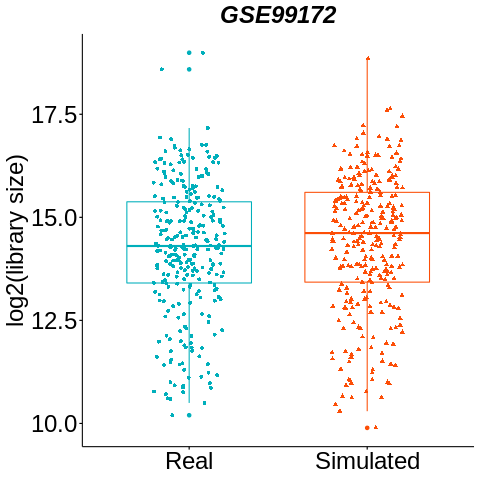 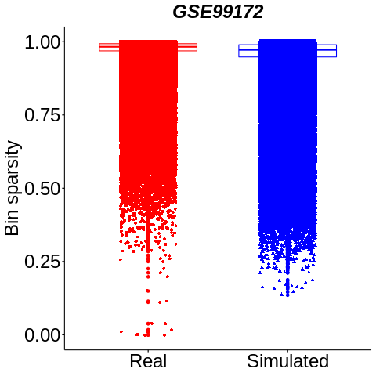 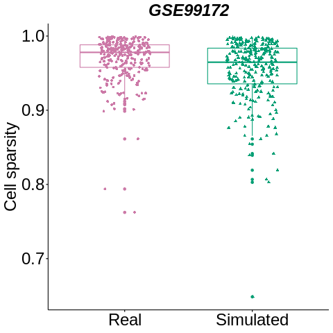
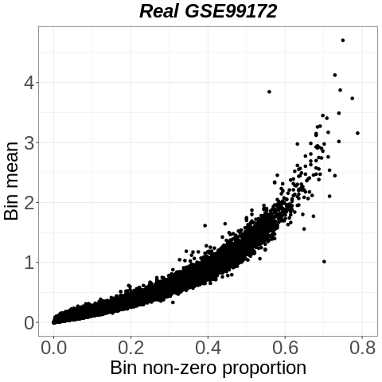 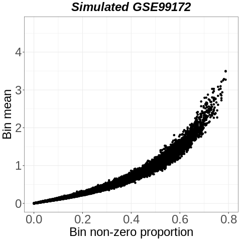

Results show that simATAC highly resembles the library size, sparsity and averaged chromatin accessibility signals from real cells. simATACCompare() also reports the Pearson correlation between real and simulated bin means (excluding bins having non-zero cell proportion higher than 0.8 in a real matrix), and Pearson correlation between real and simulated non-zero cell proportion for the corresponding bins.

| Parameter  | Correlation |
| ------------- | ------------- |
| Bin mean  | 0.96  |
| Non-zero cell proportion  | 0.96  |

Here are the plots to compare the main characteristics of 1000 simulated cells with 288 real cells:

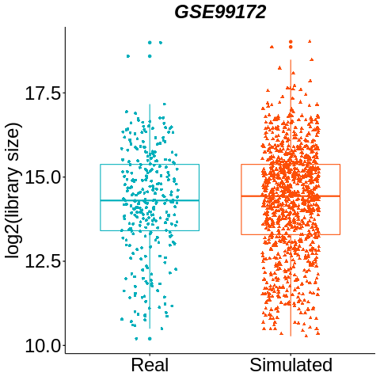  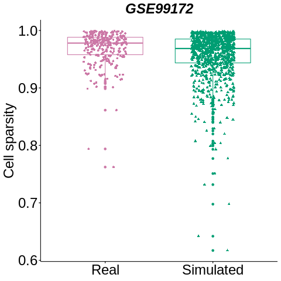
 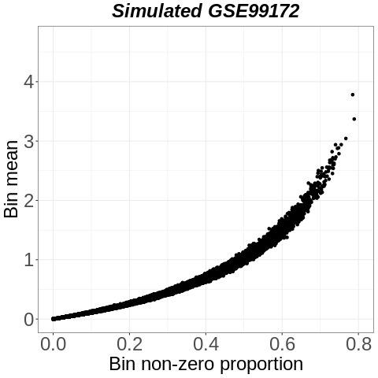


<a name="noise"></a>**Add Gaussian noise**

simATAC offers additional Gaussian noise to the final synthesized bin by cell matrix, which will blur the difference in the read distributions across different cell types, and mimic sequencing artifacts. Default Gaussian noise parameters are mean: 0 and standard deviation:0. We can set the desired mean and standard deviation via setParameters(). We observed that mean and standard deviation pairs of (-0.3, 0.3) and (-0.4, 0.4) preserve the distribution of reads in bins and cells reasonably close to real data while making the cell clustering task harder for the combination of multiple cell groups. In the example below, we first simulate 288 cells with extra noise (mean: -0.3, sd: 0.3) and compare its parameters to the original matrix.

```bash
> object <- simATACEstimate(t(count))
simATAC is:
...estimating library size...
...estimating non-zero cell proportion...
...estimating bin mean...
> object <- setParameters(object, noise.mean = -0.3, noise.sd = 0.3)
> sim <- simATACSimulate(object, nCells = 288)
simATAC is:
...updating parameters...
...setting up SingleCellExperiment object...
...simulating library size...
...simulating non-zero cell proportion...
...simulating bin mean...
...generating final counts...
...Done...
> simATACCompare(assay(sim), t(count), '/GSE99172', 'GSE99172')
```

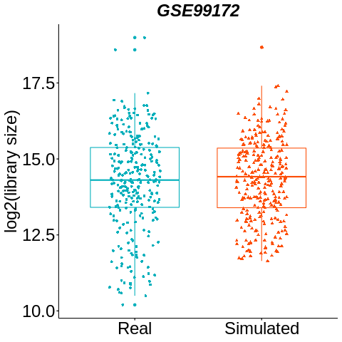 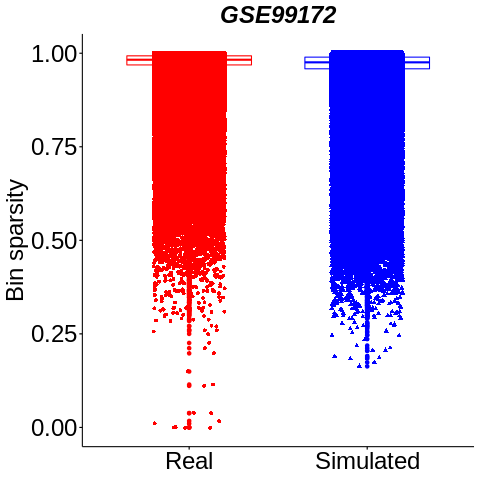 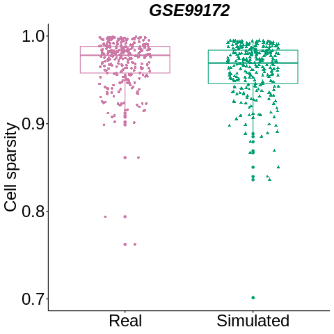
 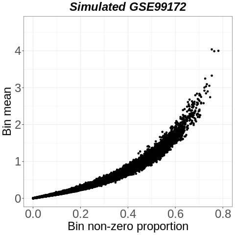

| Parameter  | Correlation |
| ------------- | ------------- |
| Bin mean  | 0.96  |
| Non-zero cell proportion  | 0.96  |

[scater]: https://github.com/davismcc/scater
[SCE]: https://github.com/drisso/SingleCellExperiment
[SE]: https://github.com/Bioconductor/SummarizedExperiment
